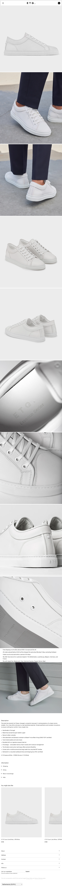

# Procesverslag

## Cesar van Hardeveld

  
uitwerken voor kick-off werkgroep

### Auteur:

Cesar van Hardeveld

#### Je startniveau:

Rood

#### Je focus:

responsive

## Je website

  
uitwerken voor kick-off werkgroep

### Je opdracht:

https://www.etq-amsterdam.com/

#### Screenshot(s) van de eerste pagina (small screen):

hier de naam van de pagina  
 

#### Screenshot(s) van de tweede pagina (small screen):

hier de naam van de pagina  
 

## Toegankelijkheidstest 1/2 (week 1)

  
uitwerken na test in 1e werkgroep

### Bevindingen

De letters zijn vaak erg klein en moeilijk te lezen zelfs wanneer je geen handicaps hebt

#### Screenreader

homepage titels voor story leest hij niet
schoenen in carrousel is “link”

dit is makkelijk op te lossen door deze op een semantische manier in de website te verwerken.

#### Muis en Toetsenbord

dropdown van kleuren zegt niet zo veel hierom moet je veel klikken voor je weet wat je favoriete kleur is.

een voorvertoning van de kleur laten zien

#### Motoriek (shocks, elastiekjes)

veel buttons zijn erg klein.

misschien een idee om de buttons te vergtoren in een bepaalde modus

#### Visueel (brillen, contrast, kleurenblind, dark/light).

Te klein lettertype en of je moet inzoomen
shoppingbag is klein.
er kleine cursor
geen Dark mode

Al deze dingen kunnen vergroot worden en een darkmode is natuurlijk ook totaal geen verkeerde keuzen.

## Breakdownschets (week 1)

  
uitwerken na afloop 2e werkgroep

### de home pagina:

  

### de product pagina:

  

### dynamisch deel (bijv menu):

  

## Voortgang 1 (week 2)

  
uitwerken voor 1e voortgang

### Stand van zaken

De breakdown schetsen waren moeilijk en helemaal om dit vervolgens te vertalen naar html code was een challenge maar ik merkte wel dat het hielp om op deze manier een overzicht te krijgen.

### Agenda voor meeting

samen met je groepje opstellen

| Nensi          | Lichelle        | Syarah            | Linsey  | Cesar           |
| -------------- | --------------- | ----------------- | ------- | --------------- |
| css selectoren | Breakdownschets | breakdown schets, | afwezig | Breakdownschets |
|                |                 | basic html vragen |         |                 |
| ...            | ...             | ...               | ...     | ...             |

### Verslag van meeting

hier na afloop snel de uitkomsten van de meeting vastleggen

- Ik kan nog wat beter aan mijn breakdownschetsen werken
- Ik mis hier en daar wat duidelijkheid
- Misschien is mijn website moeilijker dan gedacht

## Voortgang 2 (week 3)

  
uitwerken voor 2e voortgang

### Stand van zaken

Ik heb een begin gemaakt met de CSS en html mijn menu is al af en ik ben begonnen aan de footer

### Agenda voor meeting

samen met je groepje opstellen

| Nensi        | Lichelle    | Syarah      | Linsey      | Cesar      |
| ------------ | ----------- | ----------- | ----------- | ---------- |
| menu styling | geen vragen | Css-styling | geen vragen | lettertype |
|              |             |             |             |            |
| ...          | ...         | ...         | ...         | ...        |

### Verslag van meeting

hier na afloop snel de uitkomsten van de meeting vastleggen

- misschien had ik beter nog niet aan mijn css kunnen werken want ik heb hier en daar wat html fouten gemaakt waardoor ik mijn selectoren weer allemaal opnieuw moet maken.

## Toegankelijkheidstest 2/2 (week 4)

  
uitwerken na test in 8e werkgroep

### Bevindingen

Het tabben tussen alle interactieve items gaat goed. Wel wordt er getabt over het hamburger menu ondanks deze op display none staat. Ik weet dus niet helemaal hoe ik het anders moet oplossen.

#### Screenreader

De screenreader werkt prima op de website. Wat ik wel nog vaak mis is beschrijvingen van linkjes, afbeeldingen en knoppen maar de volgorde waarin mijn html staat is wel goed.

#### Muis en Toetsenbord

De padding rondom de knoppen zijn een beetje te klein waarom de gebruiker soms erg nauwkeurig moet klikken.

Om dit op te lossen heb ik de padding omhoog gehaald.

#### Motoriek (shocks, elastiekjes)

Ook hier waaren eigenlijk sommige elementen erg klein en moeilijk te klikken helemaal op de telefoon.

De paddings zijn allemaal iets vergroot.

#### Visueel (brillen, contrast, kleurenblind, dark/light).

De teksten waren erg moeilijk te lezen maar om dit op te lossen is het mogelijk de website een stuk in te zoemen en deze teksten weer duidelijk zichtbaar te maken.

## Voortgang 3 (week 4)

  
uitwerken voor 3e voortgang

### Stand van zaken

hier dit ging goed & dit was lastig (neem ook screenshots op van delen van je website en code)

### Agenda voor meeting

samen met je groepje opstellen

| Nensi             | Lichelle      | Syarah              | Linsey | Cesar            |
| ----------------- | ------------- | ------------------- | ------ | ---------------- |
| scrollen homepage | side menu en  | css-styling menu en | ...    | html en dropdown |
|                   | detail-pagina | detail-pagina       |        | list footer      |
| ...               | ...           | ...                 | ...    | ...              |

### Verslag van meeting

hier na afloop snel de uitkomsten van de meeting vastleggen

- gellukkig zat ik op de goede richting met mijn dropdown footer menu en heb ik eigenlijk de html en css helemaal goed opgebouwd.
- Het gaat ook best makkelijk worden om dit goed uit te werken met javascript.

## Eindgesprek (week 5)

  
uitwerken voor eindgesprek

### Dit ging goed/Heb ik geleerd:

Korte omschrijving met plaatjes

### Dit was lastig/Dit is me niet gelukt:

### Dit ging goed/Heb ik geleerd:

Korte omschrijving met plaatjes

### Dit was lastig/Dit is me niet gelukt:

### Dit ging goed/Heb ik geleerd:

Korte omschrijving met plaatjes

### Dit was lastig/Dit is me niet gelukt:

### Dit ging goed/Heb ik geleerd:

Korte omschrijving met plaatjes

### Dit was lastig/Dit is me niet gelukt:

## Bronnenlijst

  
continu bijhouden terwijl je werkt

Nb. Wees specifiek ('css-tricks' als bron is bijv. niet specifiek genoeg).

1. bron 1
2. bron 2
3. ...

